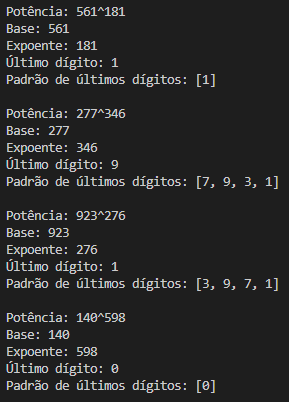

# UltimoDigito

Código antigo que encontrei no pc. Realiza um truque matemático pra descobrir o último dígito de uma potência. O interessante desse truque é que ele permite descobrir o último dígito até mesmo de potências gigantescas (como 2 elevado a 12321390213) de imediato.

Esse truque é fundamentado por um padrão(uma sequência de últimos dígitos) que surge ao multiplicar um número por ele mesmo repetidas vezes. 

## Screenshots

Testando alguns números.

